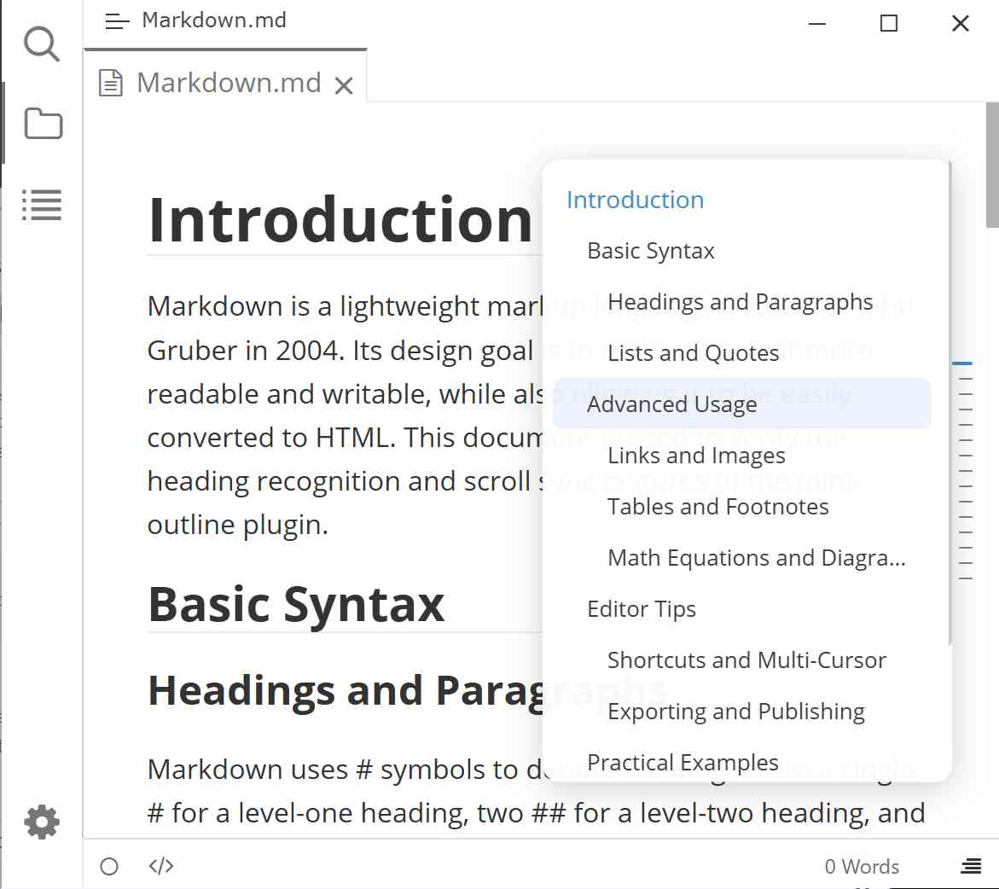

# Typora Mini Outline

English | [简体中文](./README.zh-CN.md)

This is a [Typora](https://typora.io) plugin based on the [typora-community-plugin](https://github.com/typora-community-plugin/typora-community-plugin).

Displays a floating outline bubble on the right side of the editor, syncing scroll position in real-time and supporting click-to-jump to corresponding headings.

## Preview

## Installation

1. Install [typora-community-plugin][core]
2. Open "Settings -> Plugin Marketplace", search for **Mini Outline** and install it.

[core]: https://github.com/typora-community-plugin/typora-community-plugin
