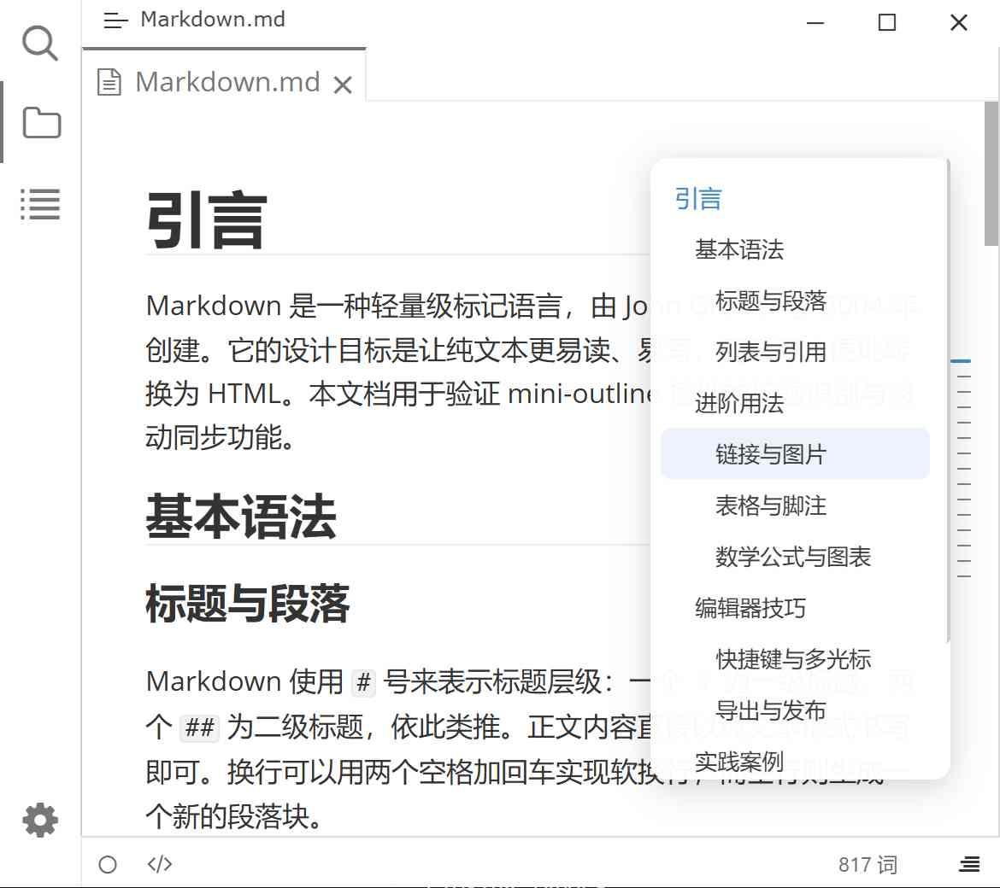

# Typora Mini Outline

[English](./README.md) | 简体中文

这是一个基于 [typora-community-plugin](https://github.com/typora-community-plugin/typora-community-plugin) 的 [Typora](https://typoraio.cn) 插件。

在编辑器右侧显示浮动大纲气泡，实时同步滚动位置并支持点击跳转至对应标题。

## 预览

## 安装

1. 安装 [typora-community-plugin][core]
2. 打开 "设置 -> 插件市场"（Settings -> Plugin Marketplace），搜索 **Mini Outline** 并安装。

[core]: https://github.com/typora-community-plugin/typora-community-plugin
